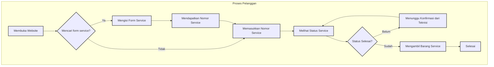

# Activity Diagram - Customer

Berikut adalah diagram aktivitas (Activity Diagram) dalam format Mermaid yang menggambarkan alur kerja untuk aktor **Customer**.

Anda bisa menggunakan kode ini di editor yang mendukung Mermaid (seperti Obsidian, GitLab, atau editor online) untuk melihat visualisasinya.

### Penjelasan Alur:

1.  **Membuka Website**: Pelanggan memulai dengan mengakses halaman utama.
2.  **Pilihan Aksi**: Pelanggan memiliki dua pilihan utama:
    *   **Mengisi Form Service**: Jika mereka adalah pelanggan baru atau ingin mengajukan servis baru.
    *   **Memasukkan Nomor Service**: Jika mereka sudah memiliki nomor servis (TNS) dan ingin melacak statusnya.
3.  **Mendapatkan Nomor Service**: Setelah berhasil mengisi dan mengirim formulir, sistem akan memberikan nomor servis unik.
4.  **Melihat Status Service**: Pelanggan menggunakan nomor servis untuk melihat detail dan progres pengerjaan perangkat mereka.
5.  **Pengecekan Status**: Sistem akan menampilkan apakah servis sudah selesai atau masih dalam proses.
    *   **Belum Selesai**: Pelanggan akan menunggu pembaruan lebih lanjut dari teknisi. Alur kembali ke pengecekan status.
    *   **Sudah Selesai**: Pelanggan dapat melanjutkan ke proses pengambilan barang.
6.  **Mengambil Barang**: Pelanggan mengambil perangkat yang telah selesai diservis.
7.  **Selesai**: Proses untuk pelanggan tersebut berakhir.

File diagram ini juga telah saya simpan di `CUSTOMER_ACTIVITY_DIAGRAM.md` pada direktori utama proyek Anda.