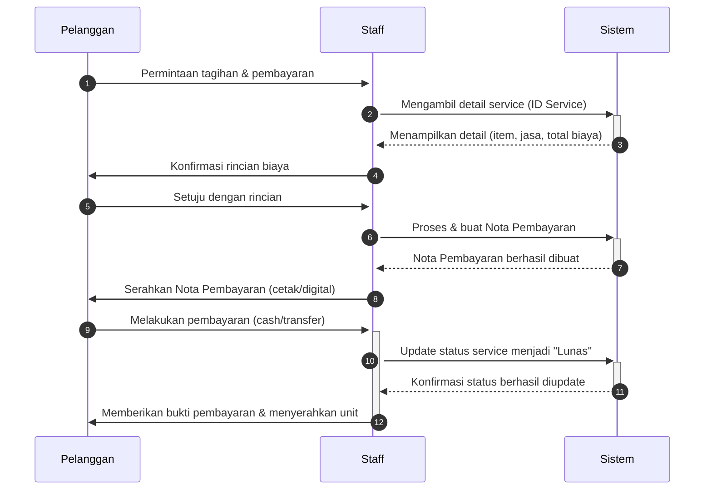

**Penjelasan Aktor:**
- **Pelanggan:** Pemilik unit yang akan melakukan pembayaran.
- **Staff:** Karyawan (kasir/admin) yang melayani proses pembayaran.
- **Sistem:** Aplikasi atau software yang digunakan untuk mengelola data servis dan transaksi.
