# Diagram UML & Desain Sistem Aplikasi "Form Service"

Dokumen ini berisi kumpulan diagram UML dan desain sistem untuk aplikasi "Form Service". Setiap diagram disajikan dalam format PlantUML, beserta nama file yang disarankan, caption untuk laporan, dan asumsi teknis yang dibuat selama proses desain.

1. Use Case Diagram

### Judul: Use Case Diagram
Diagram ini menggambarkan interaksi antara aktor (pengguna dan sistem eksternal) dengan fungsionalitas utama sistem "Form Service".

**Nama File:** `usecase_form_service.svg`

**Caption:**
Diagram Use Case menunjukkan fungsionalitas utama dari sistem "Form Service" dan bagaimana berbagai jenis pengguna (Aktor) berinteraksi dengannya. Diagram ini membedakan hak akses dan tugas yang dapat dilakukan oleh Customer, Staff, Manager, Owner, dan Admin.

**Asumsi Teknis:**
-   Setiap aktor memiliki batasan fungsionalitas yang jelas sesuai dengan perannya (role).
-   Aktor "Customer" adalah pengguna publik yang tidak perlu login untuk membuat dan melacak laporan.
-   Terdapat hubungan pewarisan (generalization) antar role internal (Staff, Manager, Owner, Admin), di mana role yang lebih tinggi mewarisi kemampuan role di bawahnya.
-   Sistem eksternal seperti Firebase dan Cloudinary dianggap sebagai aktor pendukung.

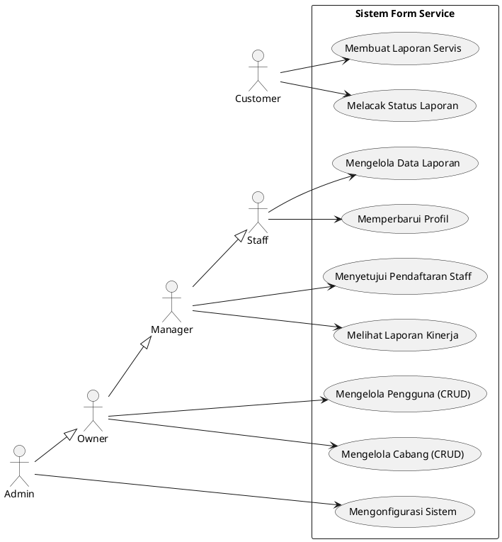

2. Class Diagram

### Judul: Class Diagram
Diagram ini memodelkan struktur statis sistem dengan menunjukkan kelas-kelas utama, atribut, method, dan hubungan antar kelas.

**Nama File:** `class_diagram_form_service.svg`

**Caption:**
Diagram Class ini merepresentasikan model domain dari aplikasi "Form Service". Diagram ini menyoroti entitas-entitas kunci seperti `User`, `ServiceRequest`, dan `Cabang`, beserta atribut, method, dan relasi asosiasi, agregasi, dan komposisi yang menjelaskan bagaimana mereka saling terhubung.

**Asumsi Teknis:**
-   Relasi antara `ServiceRequest` dan `Comment` adalah Komposisi, artinya `Comment` tidak dapat ada tanpa `ServiceRequest`.
-   Relasi antara `User` dan `Role` adalah Agregasi, karena `Role` bisa ada secara independen.
-   Atribut dan method yang ditampilkan adalah yang paling relevan dan bukan daftar lengkap.
-   `ServiceRequest` memiliki asosiasi dengan `User` (teknisi yang menangani) dan `Cabang` (lokasi servis).

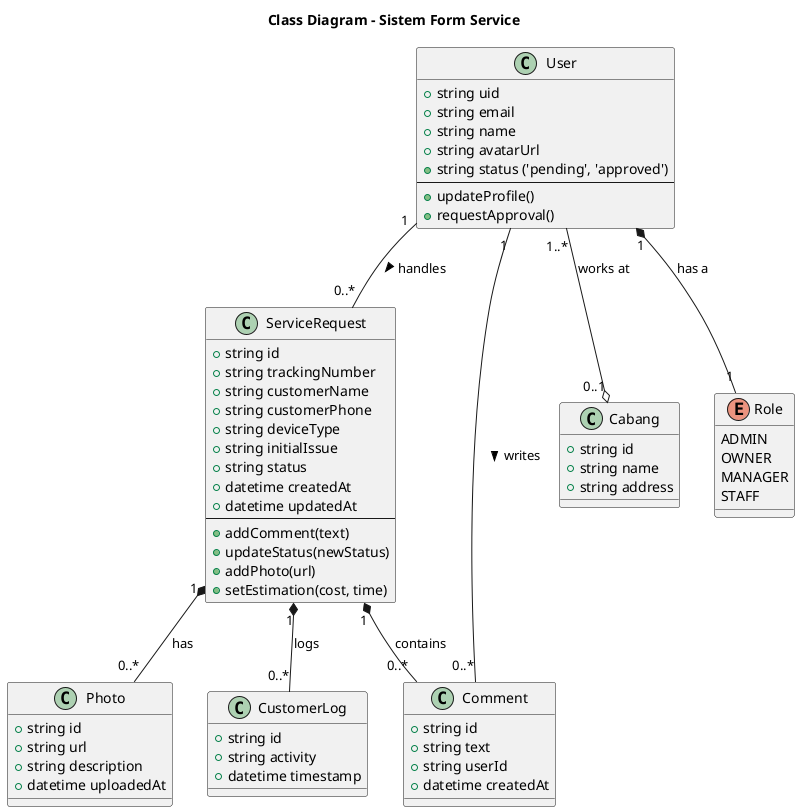

3. Sequence Diagram (4 Skenario)

#### Skenario 1: Pendaftaran Staff & Persetujuan Manager

**Nama File:** `sequence_staff_registration.svg`

**Caption:**
Diagram Sequence ini mengilustrasikan alur proses saat seorang calon staff mendaftar hingga akunnya disetujui oleh seorang Manager. Proses ini melibatkan interaksi antara pengguna, frontend, backend API, dan database Firestore.

**Asumsi Teknis:**
-   Pendaftaran membuat record user di Firestore dengan status `pending` dan role `staff`.
-   Manager menerima notifikasi atau secara aktif memeriksa daftar pengguna `pending`.
-   API backend memiliki endpoint terpisah untuk registrasi dan persetujuan.

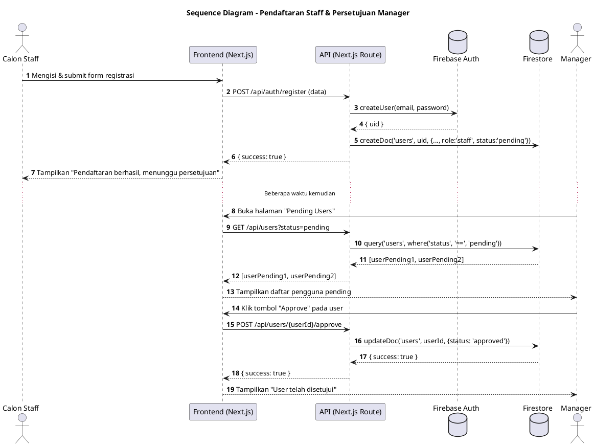

#### Skenario 2: Staff Membuat Form Service Baru

**Nama File:** `sequence_create_service_form.svg`

**Caption:**
Diagram Sequence ini merinci langkah-langkah yang terjadi ketika seorang Staff membuat laporan servis baru, termasuk proses unggah foto bukti ke Cloudinary dan penyimpanan data ke Firestore.

**Asumsi Teknis:**
-   Proses unggah foto terjadi sebelum form utama disimpan. URL foto dari Cloudinary disertakan dalam data yang dikirim ke Firestore.
-   Backend memiliki API terpisah untuk `upload` (mendapatkan signed URL dari Cloudinary) dan `create-form`.
-   Nomor lacak (`trackingNumber`) digenerate di sisi backend saat data disimpan.

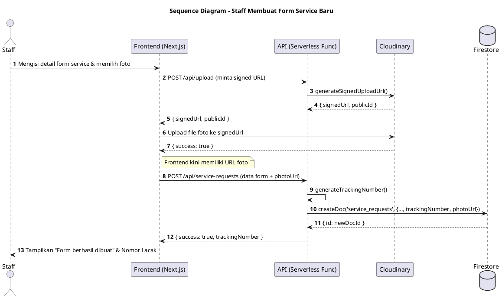

#### Skenario 3: Customer Melacak Status Servis

**Nama File:** `sequence_customer_track_status.svg`

**Caption:**
Diagram Sequence ini menunjukkan alur sederhana saat seorang Customer menggunakan nomor lacak untuk memeriksa status perbaikan perangkatnya melalui antarmuka publik.

**Asumsi Teknis:**
-   Tidak diperlukan autentikasi untuk mengakses endpoint pelacakan.
-   Endpoint API `/api/find-tns` dirancang khusus untuk pencarian publik berdasarkan `trackingNumber`.
-   Aturan keamanan Firestore (`firestore.rules`) mengizinkan pembacaan data `service_requests` secara publik jika query dilakukan melalui nomor lacak yang valid.

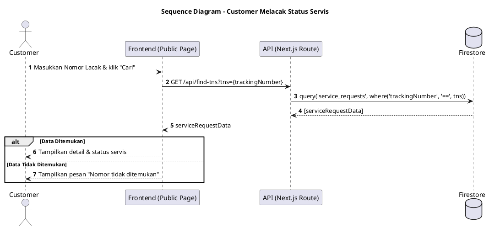

#### Skenario 4: Owner Melihat Laporan Kinerja Staff

**Nama File:** `sequence_owner_view_kpi.svg`

**Caption:**
Diagram Sequence ini menggambarkan proses saat seorang Owner mengakses dashboard untuk melihat laporan Key Performance Indicator (KPI) staff, yang datanya diagregasi dari koleksi di Firestore.

**Asumsi Teknis:**
-   KPI dihitung secara *real-time* di backend saat ada permintaan.
-   Backend API melakukan query kompleks atau agregasi data dari `service_requests` dan `users` untuk menghasilkan statistik.
-   Frontend bertanggung jawab untuk memvisualisasikan data KPI yang diterima (misalnya dalam bentuk tabel atau grafik).

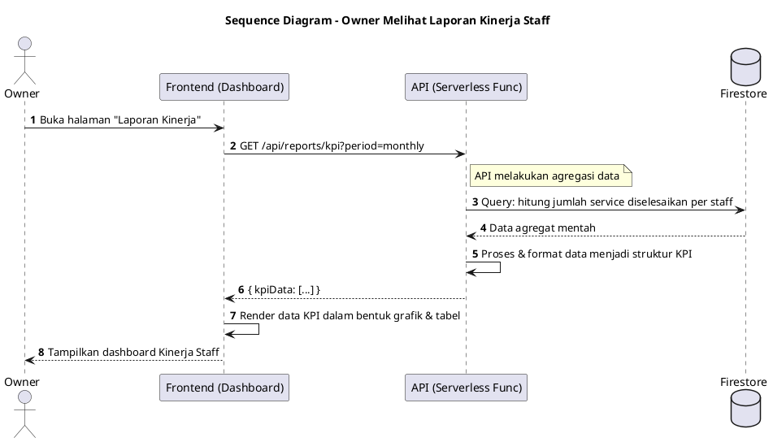

4. Activity Diagram (2 Alur)

#### Alur 1: Proses Pembuatan Laporan Servis oleh Staff

**Nama File:** `activity_create_service_flow.svg`

**Caption:**
Diagram Aktivitas ini menjabarkan langkah-langkah sekuensial dan paralel yang dilakukan oleh seorang Staff dari awal hingga akhir saat membuat sebuah laporan servis baru.

**Asumsi Teknis:**
-   Pengisian data dan unggah foto bisa dianggap sebagai aktivitas yang terjadi dalam satu fase.
-   Sistem melakukan validasi data sebelum menyimpannya ke database.
-   Setelah data tersimpan, sistem melakukan dua tindakan secara paralel: membuat log dan menampilkan konfirmasi.

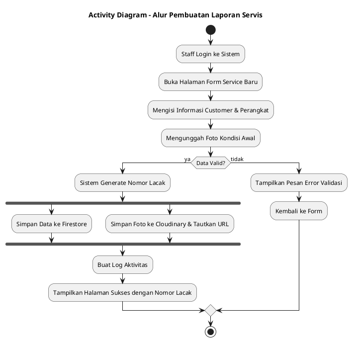

#### Alur 2: Proses Pembaruan Status Servis

**Nama File:** `activity_update_status_flow.svg`

**Caption:**
Diagram Aktivitas ini menguraikan alur kerja seorang teknisi (Staff) saat memperbarui status sebuah laporan servis, mulai dari pemilihan laporan hingga pencatatan histori perubahan.

**Asumsi Teknis:**
-   Setiap pembaruan status dicatat dalam sebuah log atau sub-koleksi untuk tujuan audit.
-   Terdapat beberapa kemungkinan alur berdasarkan status yang dipilih (misalnya, "Menunggu Sparepart" atau "Selesai").
-   Sistem secara otomatis mengirim notifikasi kepada pelanggan (asumsi fungsionalitas tambahan).

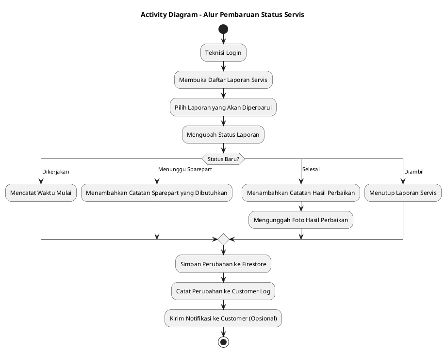

5. State Machine Diagram

### Judul: State Machine Diagram untuk ServiceRequest
Diagram ini menunjukkan berbagai status (state) yang dapat dimiliki oleh sebuah `ServiceRequest` dan transisi antar status tersebut.

**Nama File:** `statemachine_servicerequest.svg`

**Caption:**
Diagram State Machine ini memvisualisasikan siklus hidup (lifecycle) dari sebuah laporan servis (`ServiceRequest`). Diagram ini memperlihatkan semua kemungkinan status dari "Baru" hingga "Diambil" atau "Dibatalkan", serta aksi (event) yang memicu transisi dari satu status ke status berikutnya.

**Asumsi Teknis:**
-   Sebuah `ServiceRequest` selalu dimulai dari status `Baru`.
-   Transisi antar status dipicu oleh aksi yang dilakukan oleh Staff atau sistem.
-   Ada status akhir yaitu `Diambil` dan `Dibatalkan`. Dari status ini tidak ada transisi keluar.

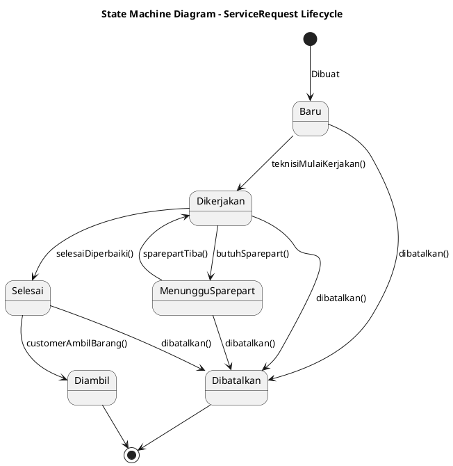

6. Component Diagram

### Judul: Component Diagram
Diagram ini memecah sistem menjadi komponen-komponen logis utama dan menunjukkan dependensi di antara mereka.

**Nama File:** `component_diagram_form_service.svg`

**Caption:**
Diagram Komponen ini menyajikan arsitektur modular dari aplikasi "Form Service". Diagram ini mengidentifikasi komponen-komponen utama seperti Antarmuka Pengguna (UI), Logika Aplikasi (Hooks & Libs), dan API Backend, serta interaksinya dengan layanan eksternal seperti Firebase dan Cloudinary.

**Asumsi Teknis:**
-   Struktur komponen didasarkan pada direktori proyek Next.js (`/src/app`, `/src/components`, `/src/lib`).
-   Komponen `API Routes` bertindak sebagai fasad (facade) yang menyembunyikan kompleksitas interaksi dengan layanan backend.
-   `UI Components` adalah komponen React yang dapat digunakan kembali, terpisah dari logika halaman.

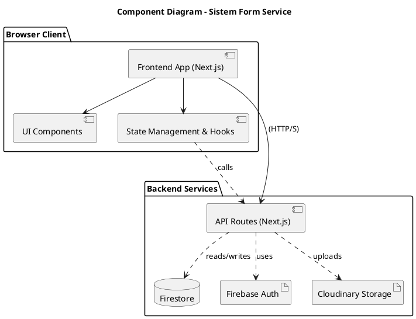

7. Deployment Diagram

### Judul: Deployment Diagram
Diagram ini menunjukkan arsitektur fisik dan logis dari penempatan (deployment) sistem.

**Nama File:** `deployment_diagram_form_service.svg`

**Caption:**
Diagram Deployment ini mengilustrasikan bagaimana komponen perangkat lunak aplikasi "Form Service" dipetakan ke infrastruktur perangkat keras dan layanan cloud. Ini menunjukkan bahwa pengguna berinteraksi dengan aplikasi Next.js yang di-hosting di Vercel, yang kemudian berkomunikasi dengan layanan backend dari Firebase dan Cloudinary.

**Asumsi Teknis:**
-   Aplikasi di-hosting di Vercel, yang menyediakan lingkungan serverless, web server, dan CDN secara terintegrasi.
-   Firebase (Firestore, Auth, Functions) dan Cloudinary adalah layanan PaaS (Platform as a Service) yang dikelola secara terpisah.
-   `Cloud Functions` adalah asumsi untuk tugas-tugas backend yang lebih berat atau terjadwal, meskipun API Routes Next.js mungkin sudah cukup.

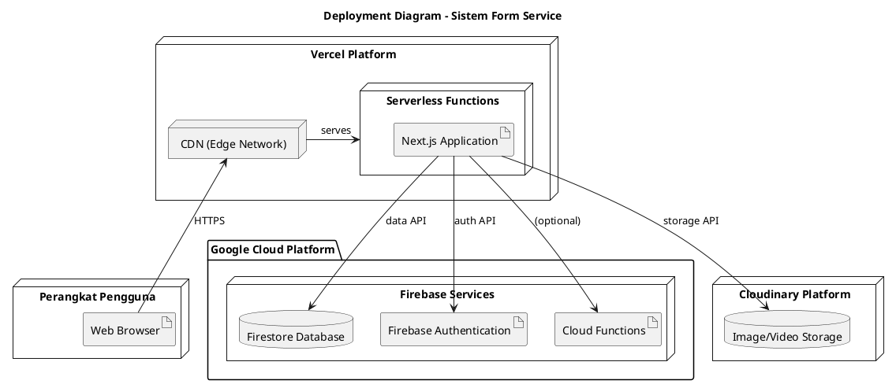

8. Package Diagram

### Judul: Package Diagram
Diagram ini mengelompokkan kelas atau file ke dalam package dan menunjukkan dependensi antar package tersebut.

**Nama File:** `package_diagram_form_service.svg`

**Caption:**
Diagram Package ini menunjukkan organisasi kode sumber proyek "Form Service" berdasarkan struktur direktori. Ini menggambarkan bagaimana `pages` (dalam `app`), `components`, `hooks`, dan `lib` saling bergantung untuk membentuk aplikasi yang kohesif.

**Asumsi Teknis:**
-   Struktur package mencerminkan struktur folder dalam proyek Next.js.
-   `app` berisi halaman-halaman dan routing.
-   `components` berisi komponen UI yang sifatnya presentasional.
-   `hooks` berisi logika stateful yang dapat digunakan kembali.
-   `lib` berisi logika bisnis inti, konfigurasi, dan utilitas.

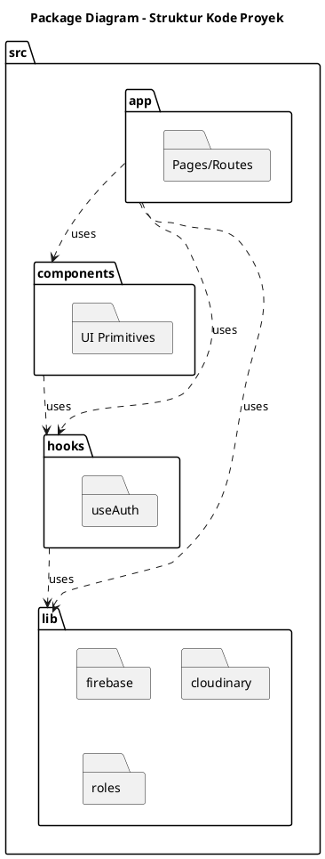

9. Entity Relationship Diagram (ERD)

### Judul: Entity Relationship Diagram (ERD)
Diagram ini menggambarkan model data logis dan hubungan antar entitas dalam database (Firestore).

**Nama File:** `erd_form_service.svg`

**Caption:**
Entity Relationship Diagram (ERD) ini mendefinisikan skema database untuk aplikasi "Form Service" yang diimplementasikan di Firestore. Diagram ini menunjukkan entitas utama seperti `users` dan `service_requests`, atribut-atributnya dengan tipe data, serta hubungan kunci primer (PK) dan kunci asing (FK) yang membentuk relasi antar data.

**Asumsi Teknis:**
-   Model ini adalah representasi logis; implementasi di NoSQL (Firestore) akan menggunakan koleksi dan sub-koleksi.
-   `PK` menandakan ID unik dokumen.
-   `FK` menandakan ID dokumen dari koleksi lain yang disimpan sebagai referensi.
-   Tipe data disederhanakan (misalnya `string`, `datetime`).

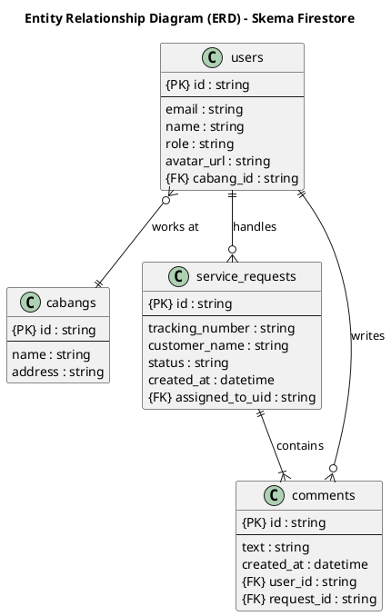

10. Data Flow Diagram (DFD)

#### Level 0: Context Diagram

**Nama File:** `dfd_level_0_context.svg`

**Caption:**
Data Flow Diagram (DFD) Level 0 atau Diagram Konteks ini memberikan pandangan tingkat tinggi tentang sistem "Form Service". Ini menunjukkan sistem sebagai satu proses tunggal dan menyoroti aliran data utama antara sistem dengan entitas eksternal (pengguna).

**Asumsi Teknis:**
-   Semua interaksi dengan layanan pihak ketiga (Firebase, Cloudinary) diabstraksikan di dalam proses utama.
-   Aliran data yang ditampilkan adalah yang paling krusial.

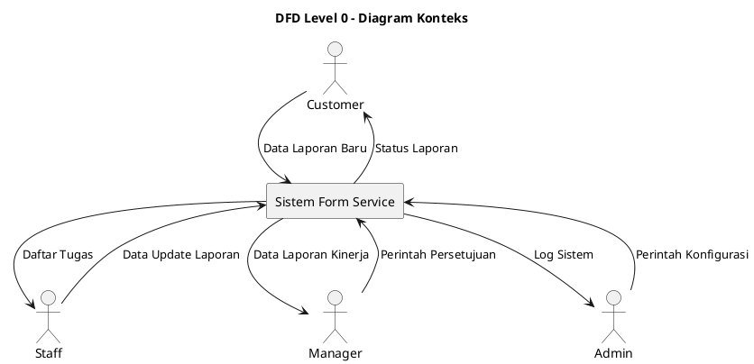

#### Level 1: Detailed DFD

**Nama File:** `dfd_level_1_detail.svg`

**Caption:**
Data Flow Diagram (DFD) Level 1 ini memecah "Sistem Form Service" dari diagram konteks menjadi beberapa sub-proses utama. Ini memberikan gambaran yang lebih rinci tentang bagaimana data mengalir di antara sub-proses, penyimpanan data (data store), dan entitas eksternal.

**Asumsi Teknis:**
-   Sistem dipecah menjadi empat proses utama yang logis.
-   Data Stores (`D1`, `D2`, `D3`) merepresentasikan koleksi utama di Firestore.
-   Aliran data menunjukkan interaksi logis, bukan pemanggilan fungsi teknis.

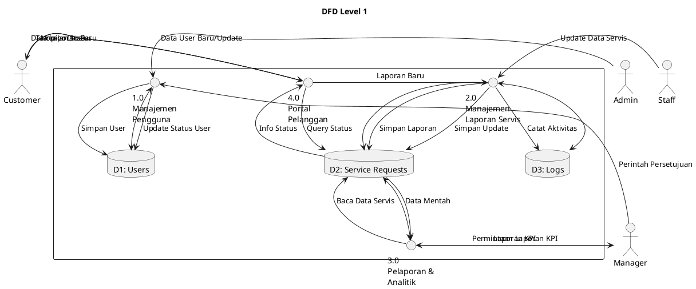

